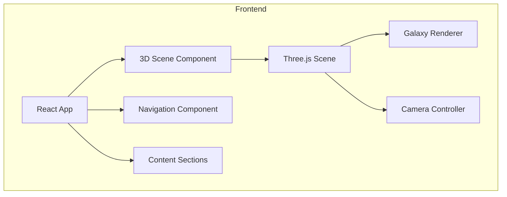

## 1. Architecture Design


## 2. Technology Description
- Frontend: React@18 + TypeScript + Vite
- 3D Library: Three.js
- Styling: Tailwind CSS
- Animation: GSAP (可选，用于页面动画)
- State Management: React Context (简单状态)

## 3. Route Definitions
| Route | Purpose |
|-------|---------|
| / | 首页，包含3D宇宙场景和所有业务信息 |

## 4. File Structure
```
/workspace
├── src/
│   ├── components/
│   │   ├── GalaxyScene.tsx      # 3D宇宙场景组件
│   │   ├── Navigation.tsx       # 导航栏组件
│   │   ├── Hero.tsx             # 首页英雄区域
│   │   ├── ServiceCard.tsx      # 业务卡片组件
│   │   └── Footer.tsx           # 页脚组件
│   ├── hooks/
│   │   └── useScrollProgress.ts # 滚动进度钩子
│   ├── utils/
│   │   └── threeHelpers.ts      # Three.js辅助函数
│   ├── pages/
│   │   └── Home.tsx             # 首页
│   ├── App.tsx                  # 应用入口
│   ├── main.tsx                 # React入口
│   └── index.css                # 全局样式
├── index.html
├── package.json
├── tsconfig.json
├── vite.config.ts
└── tailwind.config.js
```

## 5. Component Structure
### GalaxyScene.tsx
- 初始化Three.js场景
- 创建星球、小行星、星系、黑洞
- 实现相机动画控制器
- 响应滚动进度

### Navigation.tsx
- 固定顶部导航
- 平滑滚动到各业务模块
- 响应式设计

### ServiceCard.tsx
- 展示单个业务信息
- 悬停效果
- 平滑出现动画
