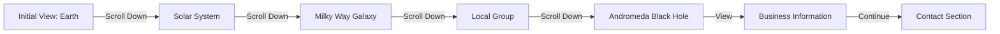

## 1. Product Overview
LunarByte是一家科技公司的沉浸式3D官网，通过宇宙探索的视觉叙事展示公司的四大核心业务。用户通过滚动页面体验从地球→太阳系→银河系→本星系群→仙女座黑洞的壮丽旅程。

- 以宇宙探索为叙事主线，通过滑动控制相机位置
- 展示LunarByte的四大核心业务：软件开发、服务托管、游戏开发帮助、AI agents帮助
- 目标用户：潜在客户、合作伙伴、求职者，建立高端科技公司的品牌形象

## 2. Core Features

### 2.1 User Roles
| Role | Registration Method | Core Permissions |
|------|---------------------|------------------|
| Normal Visitor | None | Browse entire website, view all content |

### 2.2 Feature Module
1. **Home page**: 3D宇宙场景、滚动动画导航、业务展示、联系信息

### 2.3 Page Details
| Page Name | Module Name | Feature description |
|-----------|-------------|---------------------|
| Home page | 3D Universe Scene | Three.js渲染的逼真3D宇宙，包含地球、太阳系、银河系、小行星、星云、黑洞等 |
| Home page | Scroll-Controlled Camera | 用户滚动控制相机从地球→太阳系→银河系→本星系群→仙女座黑洞移动 |
| Home page | Business Sections | 四大核心业务板块，在黑洞附近呈现信息 |
| Home page | Swiss Modern Typography | 纯黑背景，瑞士现代主义排版设计 |
| Home page | Responsive Design | 全自适应布局，支持各种设备尺寸 |

## 3. Core Process
用户访问页面 → 初始位置在地球外太空 → 向下滚动时相机逐渐拉远/移动 → 依次路过太阳系、银河系、本星系群 → 最终到达仙女座黑洞附近 → 查看公司业务信息 → 继续浏览联系信息

## 4. User Interface Design
### 4.1 Design Style
- Primary Color: Pure Black (#000000)
- Secondary Colors: White (#FFFFFF) for text
- Button Style: Minimal, understated, no icons
- Font: Helvetica Neue / Arial (sans-serif, Swiss modernist style)
- Layout Style: Grid-based, asymmetric, generous negative space
- Icon/Emoji Style: No icons or emojis at all
- Background: Solid pure black

### 4.2 Page Design Overview
| Page Name | Module Name | UI Elements |
|-----------|-------------|-------------|
| Home page | 3D Scene | Full-viewport Three.js canvas, black background, realistic planets/stars/asteroids/black hole |
| Home page | Hero Text | Large, bold white text centered, Swiss typography |
| Home page | Business Sections | Clean grid layout, white text on black, no icons, clear typographic hierarchy |
| Home page | Navigation | Scroll-based progression through universe, no traditional nav bar |

### 4.3 Responsiveness
- Desktop-first design
- Fully responsive breakpoints at 320px, 768px, 1024px, 1440px
- Touch-optimized scrolling for mobile devices
- 3D canvas maintains aspect ratio across devices

### 4.4 3D Scene Guidance
- Environment: Pure black void, no HDRI for maximum darkness
- Lighting: Subtle point lights for planets, emissive materials for stars
- Camera: Perspective camera, smooth scroll-controlled movement along predefined path
- Composition: Start close to Earth, gradually zoom out to reveal larger structures
- Interactions: Scroll triggers camera position change; no direct orbit controls
- Post-processing: Subtle glow effects, no heavy post-processing for performance
- Asset Sources: Public CDN textures (NASA, ESA, Pixabay, Unsplash)
- Performance: LOD (Level of Detail), efficient geometry, texture compression
